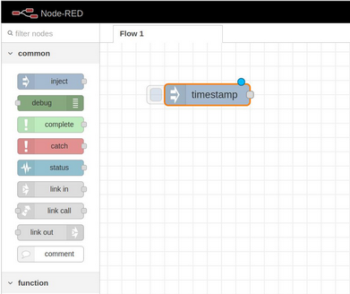
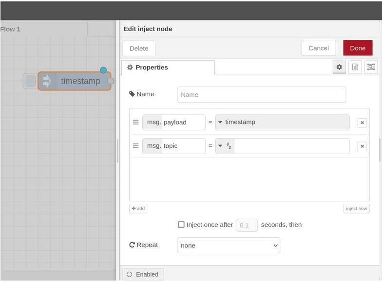
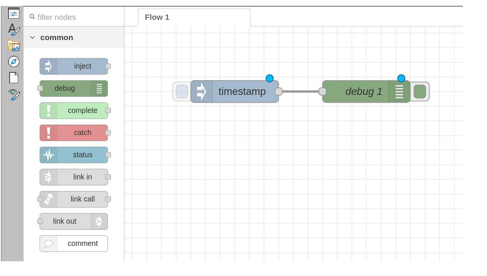
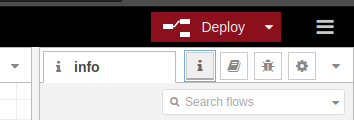
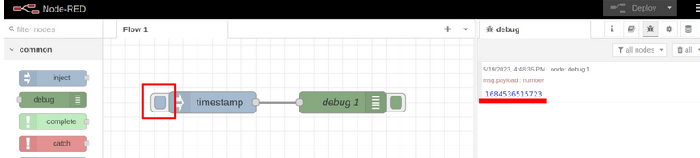
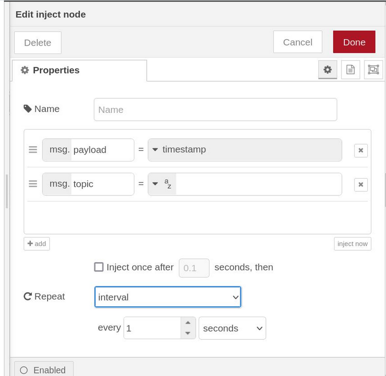
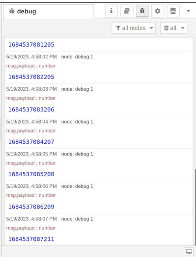
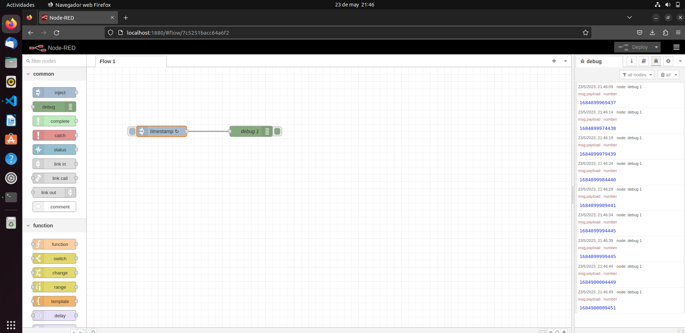

# flow1-DiplomadoIoT
Este repositorio contiene el primer flow con NodeRed

# Introducción

El flow 1 representa el primer ejercicio a realizar con NodeRed. Este ejercicio consiste únicamente en conectar un nodo Inject con un nodo Debug y automatizarlo para que genere un TimeStamp cada 1 segundo. Esta acción permite demostrar el uso de la pestaña Debug.

## Material Necesario

Para realizar este flow necesitas lo siguiente

- [Ubuntu 20.04](https://releases.ubuntu.com/20.04/)
- [Docker Engine](https://docs.docker.com/engine/install/ubuntu/#install-using-the-convenience-script)
- [NodeRed](https://nodered.org/docs/getting-started/local)

## Material de referencia

En los siguientes enlaces puedes encontrar cursos en la plataforma de edu.codigoiot.com que te permitirán realizar las configuraciones necesarias

- [Instalación de Virutal Box y Ubuntu 20.04](https://edu.codigoiot.com/course/view.php?id=812)
- [Introducción a Docker](https://edu.codigoiot.com/course/view.php?id=996)
- [Aplicacion multicontenedor de servidor IoT con Docker compose](https://edu.codigoiot.com/mod/lesson/view.php?id=3889&pageid=3804&startlastseen=no)
- [Introducción a NodeRed](https://edu.codigoiot.com/course/view.php?id=278)

## Instrucciones

### Requisitos previos

Para que este flow funcione, debes cumplir con los siguientes requisitos previos
1. Tener instalado Docker Engine.
2. Tener instaldo nodeRed por Docker Compose
3. Tener el contenedor de NodeRed con el volumen de data activado

# Preparacion
 Inicia el contenedor de docker que contiene a Node-Red con el comando:
docker start [id_del_contenedor_de_node_red]

Reemplaza la id_del_contenedor con la del contenedor correspondiente a Node-Red. Si no recuerdas cuál es puedes usar el siguiente comando para ver todos los contenedores.

docker ps -a

Nota: Si instalaste el contenedor de acurdo con el ejercicio Creación de una Aplicación Multi-Contenedor con Docker la Id será algo como: dockercompose-nodered-1

Una vez arrancado Node-Red abre un navegador y entra a la URL localhost:1880

# Nodo Inject

El primer paso de este ejercicio es insertar un nodo inject de la paleta de nodos hacia el editor visual. Este nodo nos premite insertar información arbitraria. Por default regresa una marca de tiempo.

Da doble click en el nodo para ver su configuración.

Verás las siguientes propiedades:

- __Name__: El nombre del nodo que se mostrará en la interfaz

- __msg.payload__: El contenido que regresará el nodo cuando se active (por default es timestamp pero puedes explorar otras opciones)

- __msg.topic__: El tema que regresará el nodo cuando se active

- __Inject once after ___ seconds, then__: Si se activa el nodo correrá al inicio del programa después del tiempo indicado

- __Repeat__: Permite hacer que el nodo se active cada determinado tiempo.

Cierra la configuración del nodo dando click en el área de programación o en el botón cancel.

# Nodo Debug

El nodo debug nos permite mandar mensajes a la consola de depuración ubicada en el panel de información a la derecha de la pantalla. Inserta un nodo debug y conecta su entrada con la salida de timestamp.

# Deploy

 Para ejecutar el programa da click en el botón deploy y abre la consola de depuración en el panel de información (ícono del insecto).
 
 

Para inyectar un mensaje da click en la entrada del nodo inject (el cuadrado azul a la izquierda). Verás que aparecen unos números en la consola de depuración. El tiempo se representa en formato UNIX como el número de segundos desde el primero de enero de 1970.

# Inyectar con un intervalo

Para repetir la inyección de la marca de fecha cada segundo utilizaremos la opción repeat dentro de la configuración de inject. Cambia la opción [código]repeat [termina código] a interval y modifica las casillas de abajo para que digan [código]every 1 seconds [termina código]. Cierra la ventana dando click en el botón “Done”.

Vuelve a presionar Deploy y verás que cada segundo aparece una nueva marca de tiempo en la consola de depuración.

## Resultados
A continuación puede verse una vista previa del resultado de este flow.

 

## Evidencias

- [YouTube (versión anterior)](https://youtu.be/8U-K6bgMQwE)

# Créditos

Desarrollado por Hugo Escalpelo
- [hugoescalpelo.com](https://hugoescalpelo.com/)
- [Página en Facebook](https://www.facebook.com/Hugo-Escalpelo-Profesional-337708683840136)
- [GitHub](https://github.com/hugoescalpelo)